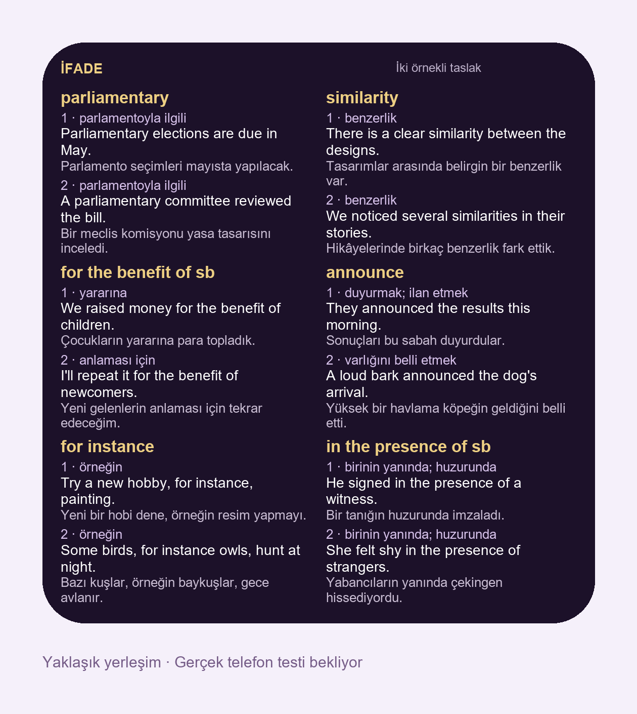

# ifade ✳

**Six expressions at a glance. Two examples for each.**

[Website and setup](https://kuurtali.github.io/uc-ifade/#kurulum) · [Türkçe](README.md) · [Contribute](CONTRIBUTING.md)

A purple and gold Scriptable Home Screen widget for English learners who speak Turkish. The collection contains **5,750 learning records and 11,500 English examples**, each with a Turkish sense label and translation. A useful alternate sense is illustrated when appropriate; otherwise the second sentence supplies another context.



*Layout illustration, not an iPhone screenshot. Native V2 layout still requires device verification; the previous single-example widget was tested on the user's phone.*

## Install once

1. Install [Scriptable](https://apps.apple.com/app/scriptable/id1405459188).
2. Open the [setup page](https://kuurtali.github.io/uc-ifade/#kurulum), select **Widget kodunu kopyala**, create a Scriptable script, paste the code, name it **İfade**, and run it once.
3. Add a **large Scriptable Home Screen widget**, edit it, and select the script.

Already using **Phrases** or **İfade**? Replace the entire contents of that script with the new code, preserve its name, and run it once. There is no need to recreate the widget. Old scripts remain compatible with the V1 data but do not automatically gain the two-example layout.

## Rotation and updates

Six records are selected per two-hour slot, aligned to 00:00, 02:00, 04:00… in Turkey, including overnight. Selection is calculated on the device; no continuously running server is needed. All records are selected in roughly 80 days of continuous progression. This does not mean every slot will actually be displayed or learned.

[iOS controls widget refresh timing](https://docs.scriptable.app/listwidget/#refreshafterdate) and may delay it. After the first online run, the full widget dataset is cached locally. A run with a cache at least 24 hours old attempts to download updated data; a failed download falls back to the cache. Code changes require a one-time script replacement.

Large widgets show six cards, medium two, small one. The rectangular Lock Screen widget shows one expression and its first example; parameter `0–5` selects a card. Legacy JPG links remain static pictures.

## Collection and review

The PDFs contain 3,004 Oxford 3000 entries, 1,999 additional Oxford 5000 entries, and 750 Phrase List entries. Merging the overlapping `audio`, `gender`, and `well-being` records produces 5,750 learning records. Separate part-of-speech/sense entries and list membership are retained, so this is not a claim of 5,750 unique spellings. No academic add-on list is included. See the [source audit](SOURCE-AUDIT.md).

Every record received AI-assisted editorial review of both examples, senses and translations. This is not independent human review, exhaustive dictionary verification, or a guarantee of correctness. [Additional dictionary evidence](meaning-evidence-v2.json) covers only 28 specified records. Two examples cannot cover every possible sense.

Mechanical checks passed for completeness and distinct examples. Approximate Arial layout checks cover 2,875 reachable group starts. Real iPhone font metrics and OS scheduling still need device verification.

## Development and licenses

Download [development-v2.zip](development-v2.zip), then run with Python 3 and Node.js:

```sh
python work/apply_reviews.py
python work/v2/build.py --preview
node work/v2/test_widget.cjs
python work/v2/build.py
```

`collection-v2.json` preserves sources and review records; `widget-data-v2.json` is the compact widget dataset. `Ifade-v2.js` is the installable script. For a self-hosted fork, change `BASE` in `work/v2/widget-runtime.js`, rebuild, and deploy the generated files alongside the website. No account or API key is required.

Code: [MIT](LICENSE). Original project learning text: CC BY 4.0. Oxford materials and legacy Tatoeba content retain their own rights and attribution. Read [CONTENT-LICENSE.md](CONTENT-LICENSE.md) and [CONTRIBUTING.md](CONTRIBUTING.md).

This is not an official Oxford University Press or Scriptable product.
