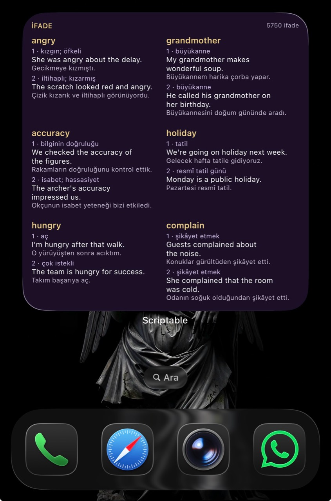

# ifade ✳

**Six expressions at a glance. Two examples each.**

A purple and gold iPhone Home Screen widget with **5,000 word entries + 750 phrases** and **11,500 examples**, Turkish meanings and translations. Where useful, the second example demonstrates another sense.

[Open the site and install →](https://kuurtali.github.io/uc-ifade/#kurulum) · [Türkçe](README.md)

*Actual iPhone 15 Pro Max screenshot. All twelve examples fit in this group. Other screen sizes and long-running V2 refresh remain unverified.*

[Step-by-step screenshots (Turkish UI) →](https://kuurtali.github.io/uc-ifade/kurulum-gorselli.html)

## Already using Phrases?

Keep your widget and update its script **once**:

1. Open the [setup page](https://kuurtali.github.io/uc-ifade/#kurulum) in Safari on your iPhone → **Widget kodunu kopyala** (copy widget code).
2. In Scriptable, tap **… on the Phrases card**. Select all the old code and paste the new code. **Keep the script name.**
3. Tap **▶**, close the preview, then **Done** to leave the editor. Return to your Home Screen; the existing widget still uses the same script.

## First installation

1. Install [Scriptable](https://apps.apple.com/app/scriptable/id1405459188) and copy the widget code from the [site](https://kuurtali.github.io/uc-ifade/#kurulum).
2. In Scriptable, tap **+**, paste the code, name it **İfade**, run with **▶**, and leave the editor.
3. Long-press your Home Screen → **Edit → Add Widget → Scriptable** → choose the **large square**. Long-press the widget → **Edit Widget → Script → İfade**.

## Daily use

- The large widget shows **6 entries and 12 examples**. No daily installation or Shortcuts automation is needed.
- Groups rotate every two hours, including overnight, using **Türkiye time**. iOS controls actual refresh timing and may delay it.
- Data downloads on first run. Once the cache is over 24 hours old, the next run attempts an update; offline runs use the cached collection.
- Content fixes arrive automatically. Releases that change the script require a one-time code update.
- The Lock Screen version shows one entry. The six-entry layout belongs on the **Home Screen**.

## Share feedback

[Content corrections, widget problems or usage feedback →](FEEDBACK.md) Requires a GitHub account; submitted reports are public.

## Sources and contributions

Oxford 3000, the additional Oxford 5000 words, and the Oxford Phrase List, with three overlapping records merged. [Source counts](SOURCE-AUDIT.md).

Every entry received AI-assisted editorial review, not independent human or dictionary verification of every record. [Report a correction](https://github.com/kuurtali/uc-ifade/issues/new) · [Contribute](CONTRIBUTING.md) · [Details and development](GUIDE.en.md).

Code: [MIT](LICENSE). Original learning text: CC BY 4.0. Oxford source rights remain with their owners. [License scope](CONTENT-LICENSE.md). Unofficial project; not affiliated with Oxford or Scriptable.
